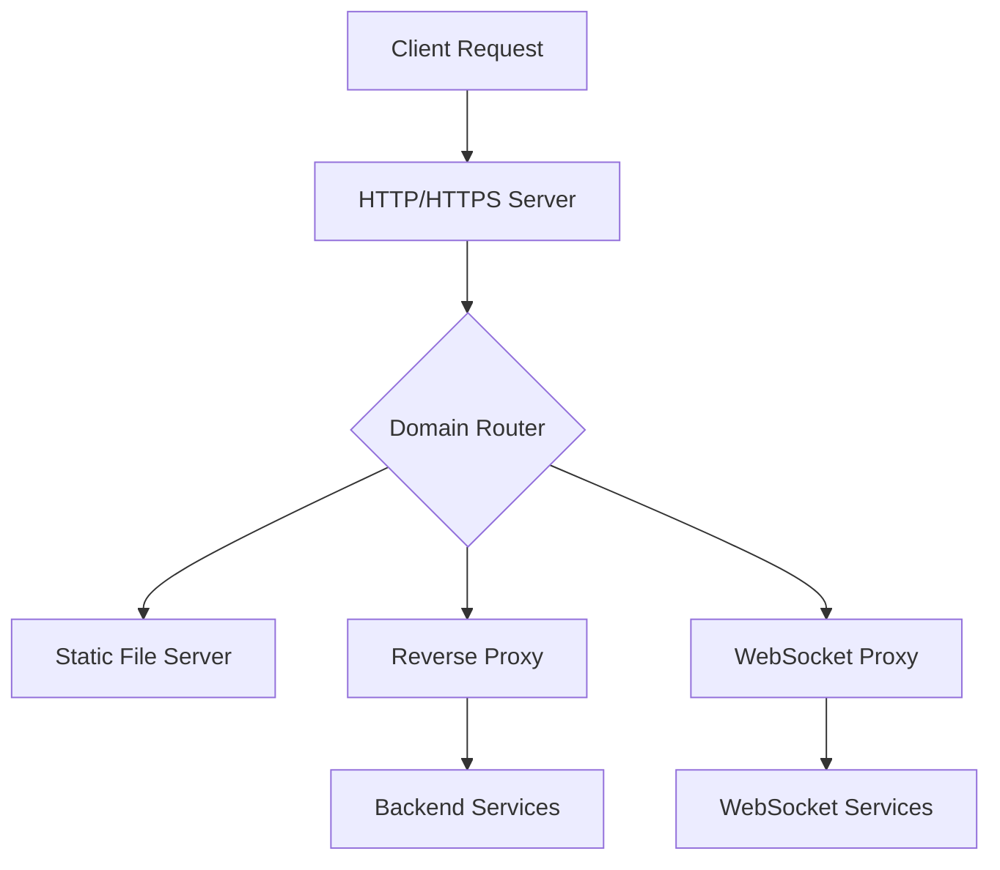

# GoProxy


A lightweight, feature-rich HTTPS reverse proxy server written in Go, with automatic SSL certificate management and multi-domain support.

## Features

- 🔒 Automatic SSL/TLS certificate management via Let's Encrypt
- 🌐 Multi-domain support
- 🔄 Easy reverse proxy configuration
- 🔌 WebSocket support
- 📁 Static file serving
- 📝 Detailed logging
- ⚡ High performance with Go's concurrency
- 🗜️ Intelligent content compression (gzip)
- 🔑 Basic authentication support per domain
- 🔄 Domain-level redirects
- 🎯 Custom fallback paths for SPAs

## Quick Start

1. Install using Go:
```bash
go install github.com/d0rc/goproxy@latest
```

2. Create a configuration file `config.txt`:
```txt
# Domain 1 configuration
domain=example.com
static_dir=/var/www/example
proxy=/api http://localhost:8080
proxy=/socket ws://localhost:8081

# Domain 2 configuration
domain=another.example.com
static_dir=/var/www/another
proxy=/backend http://localhost:9000
```

3. Run the server:
```bash
goproxy -config config.txt
```

## Configuration

The configuration file uses a simple key-value format:

- `domain`: Specifies the domain name (required for each domain block)
- `static_dir`: Directory for serving static files
- `proxy`: Format is `proxy=<path> <target_url>` where:
    - `path`: URL path to match
    - `target_url`: Destination URL to proxy (supports both HTTP and WebSocket)
- `auth`: Format is `auth=<username> <password>` for Basic Authentication
- `fallback_path`: Path to serve when a static file is not found (e.g., for SPA routing)
- `redirect`: Redirects all requests to the specified domain while preserving paths and query parameters

The proxy automatically handles content compression (gzip) for appropriate content types including:
- Text files (HTML, CSS, JavaScript, etc.)
- JSON and XML responses
- Form-encoded data
- While skipping already-compressed content (images, videos, archives)

### Example Configuration

```txt
# Main website
domain=example.com
static_dir=/var/www/main
proxy=/api https://api.internal:8080
proxy=/ws ws://websocket.internal:8081
fallback_path=/index.html

# Redirect www subdomain to naked domain
# A request to www.example.com/blog?page=2 will redirect to example.com/blog?page=2
domain=www.example.com
redirect=example.com

# Admin panel
domain=admin.example.com
static_dir=/var/www/admin
auth=adminuser strongpassword

# Complete example showing all features
domain=example.com
static_dir=/var/www/main
proxy=/api https://api.internal:8080
proxy=/ws ws://websocket.internal:8081
fallback_path=/index.html
auth=admin secretpassword
redirect=example.com   # Optional redirect target
```

## Features in Detail

### SSL/TLS Certificate Management

- Automatic certificate acquisition and renewal via Let's Encrypt
- Certificates are cached locally in the `certs` directory
- Automatic renewal 30 days before expiration
- HTTP-01 challenge support

### Reverse Proxy Features

- Path-based routing
- WebSocket support with automatic protocol upgrade
- Error handling and logging
- Request/response header modification
- Connection state monitoring

### Static File Serving

- Serve static files for each domain
- Automatic index file serving
- Clean URLs without file extensions

### Logging

- Detailed request logging with timing
- Certificate management logging
- Connection state changes
- Error logging with stack traces

## Architecture



## Building from Source

```bash
git clone https://github.com/d0rc/goproxy
cd goproxy
go build
```

### Prerequisites

- Go 1.16 or later
- External dependencies:
    - github.com/gorilla/mux
    - github.com/gorilla/websocket
    - golang.org/x/crypto/acme
    - golang.org/x/crypto/acme/autocert

## Production Deployment

1. Set up proper system user and permissions
2. Configure systemd service (recommended)
3. Set up log rotation
4. Configure firewall rules (ports 80 and 443)
5. Update email address in certificate manager configuration

### Example Systemd Service

```ini
[Unit]
Description=GoProxy HTTPS Reverse Proxy
After=network.target

[Service]
Type=simple
User=goproxy
ExecStart=/usr/local/bin/goproxy -config /etc/goproxy/config.txt
Restart=always
RestartSec=5
LimitNOFILE=65535

[Install]
WantedBy=multi-user.target
```

## Security Considerations

- Regularly update the software and dependencies
- Monitor certificate renewal status
- Use proper file permissions for certificates and configuration
- Configure appropriate security headers
- Consider rate limiting for production use
- Keep backup of certificates and configuration

## Resources

- [GoProxy: Hosting Static and Dynamic Sites with Ease](https://legacysupportteam.com/blog/goproxy-hosting-static-dynamic-sites/) - A comprehensive guide on using GoProxy for static and dynamic site hosting
- [GitHub Repository](https://github.com/d0rc/goproxy)

## Contributing

Contributions are welcome! Please feel free to submit pull requests. For major changes, please open an issue first to discuss what you would like to change.

1. Fork the repository
2. Create your feature branch (`git checkout -b feature/amazing-feature`)
3. Commit your changes (`git commit -m 'Add amazing feature'`)
4. Push to the branch (`git push origin feature/amazing-feature`)
5. Open a Pull Request

## License

This project is licensed under the MIT License - see the [LICENSE](LICENSE) file for details.

## Acknowledgments

- The Go team for the excellent standard library
- Gorilla toolkit developers
- Let's Encrypt for providing free SSL certificates

## Command Line Options

The following command-line options are available:
- `-config`: Path to the configuration file (default: "config.txt")
- `-account-email`: Email address for Let's Encrypt registration
